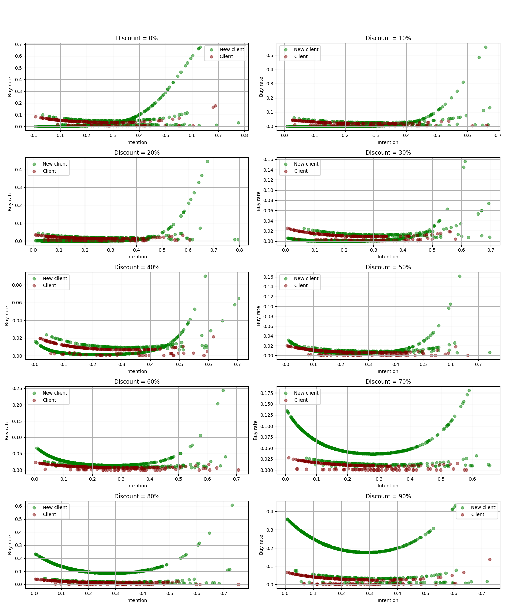
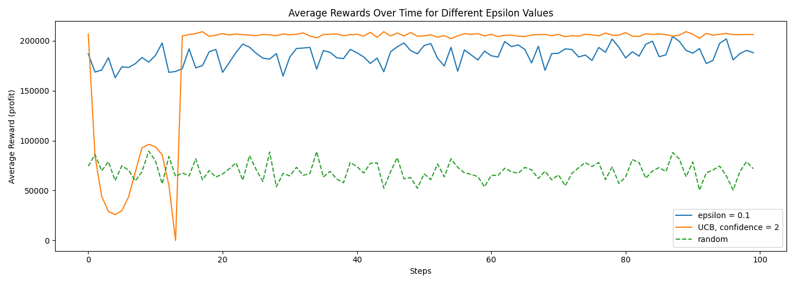

# Price optimization simulator

The main scope is to have an algorithm that updates in real time (daily, weekly, monthly, etc.) the price of a product in order to maximize some measures (profit, orders or buy rate).

This project has two main parts: 
- Simulator for a population of agents (clients that enter the site)
- Multi-Armed Bandits (MAB) problem with different algorithms to solve the optimization problem.

## Table of contents

1. [Simulator](#1-simulator)
2. [MAB Algorithms](#2-mab-algorithms)
3. [Installation](#3-installation)
4. [Population model analysis](#4-population-model-analysis)
5. [Usage](#5-usage)


---

### **1. Simulator**

The simulator is designed to model a population of clients visiting a website and their behavior when exposed to different discount levels. It simulates three key aspects for each agent (client):
1. **Buy Intention**: This is modeled using a Beta distribution and represents the likelihood that a client intends to purchase.
2. **Client Status**: This is modeled using a Bernoulli distribution to decide whether a visitor is an actual client.
3. **Number of Visits**: This is simulated using a Negative Binomial distribution to reflect the number of times a client visits the website, with the number of visits being correlated with their buy intention.

#### **Main Components**:
- **PopulationModel**: This class models the population of website visitors. It allows you to:
  - **Sample Clients**: You can generate a set of clients based on the population model, including their buy intention, client status, number of visits, and discount exposure.
  - **Fit the Model**: Using the `fit()` method, the population model can be trained to optimize its parameters (weights) based on a target value (e.g., buy rate).
  - **Act Based on Discounts**: The model can be used to predict the actions of clients (i.e., whether they will buy) when exposed to certain discount levels, using previously learned weights.
  - **Load/Save Weights**: The weights of the model can be saved or loaded to reuse a trained model in future simulations.

#### **Features**:
- **Feature Generation**: The method `_make_features()` is used to generate polynomial features from the input data (such as buy intention and visit count) to improve the model's learning process.
- **Discount Simulation**: The model samples clients' behavior with respect to various discount levels.
- **Training**: The model uses gradient descent (with Adam optimizer) to adjust its weights, and it outputs progress at regular intervals to track how well it's learning.


---

### **2. MAB Algorithms**

The project uses multiple Multi-Armed Bandit (MAB) algorithms to solve the optimization problem of selecting the best discount rate that maximizes orders, buy rate, or profit. Below are the implemented strategies:

#### **Main Algorithms**:

1. **Epsilon-Greedy**:
    - This algorithm selects a random arm (discount level) with probability `epsilon`, and the best known arm with probability `1 - epsilon`. Over time, it balances exploration (trying new discounts) and exploitation (using the best known discount).
     ```python
    class EpsilonGreedy:
        def __init__(self, n_arms, epsilon):
            self.n_arms = n_arms
            self.epsilon = epsilon
            self.counts = np.zeros(n_arms)  
            self.values = np.zeros(n_arms)  
    ```
    

2. **Upper Confidence Bound (UCB)**:
    - The UCB algorithm selects the arm (discount) with the highest upper confidence bound. It takes into account both the reward estimate and the uncertainty (or variance) of that estimate. This allows the algorithm to favor arms that have not been tested as much (exploration) while also exploiting known good arms.
    - The confidence level is used to control the trade-off between exploration and exploitation.
    
    ```python
    class UCB:
        def __init__(self, n_arms, confidence):
            self.confidence = confidence
            self.n_arms = n_arms
            self.counts = np.zeros(n_arms)  
            self.values = np.zeros(n_arms)  
    ```

#### **Simulation**:

The `simulate()` function simulates a period of `n_days`, where a bandit algorithm selects a discount each day and updates its strategy based on the observed rewards (orders, buy rate, or profit). It supports the following algorithms:
- `epsilon_greedy`
- `random`
- `UCB`

The simulation process involves:
- Selecting an arm (discount level) based on the current state of the algorithm.
- Simulating the orders and buy rate for the selected discount using the `orders_and_rate_per_day()` function.
- Updating the algorithm based on the observed reward (orders, buy rate, or profit).

In a real life scenario we can update the algorithm with the actual number of orders from total views from a day/week/month at each step. 

#### **Rewards**:

In the simulation, you can optimize for different types of rewards:

- **Orders**: The total number of orders placed at a given discount rate.
- **Buy Rate**: The proportion of agents who buy after visiting the site.
- **Profit**: The total profit, which is calculated by the formula:
     $$Profit = Orders * (1 - Discount) * Product Price$$

---

### **3. Installation**
To run this project, you need to:

1. Clone the repository:
    ```bash
    git clone https://github.com/alexandra-dragomir/Price-optimization
    ```
   
2. Install the required dependencies:
    ```bash
    pip install torch, numpy, matplotlib
    ```

---

### **4. Population model analysis**

After fitting the population model to have a buy rate of 0.8% (it cand be trained again using the .fit() function or load the weights from the .pth file) we have the following dependencies between buy rate and discounts/buy_intention. The code is in "Population_model_analysis.ipynb"


How the buy rate is influenced by the buy_intention variable for different discount values. The blue dots represent new clients and the red ones existing clients.


---


### **5. Usage**

In the "MAB_algorithms.ipynb" file there is a demo of the steps needed to run the algorithm and the plots resulted from it.

#### Examples with the evolution of the mean reward (profits, orders, buy rate) using the Multi Armed Bandits algorithm 

Evolution for profit in 100 days using Epsilon-Greedy, UCB and random, having discounts from 0 to 100%


Evolution for orders in 100 days using Epsilon-Greedy, UCB and random, having discounts from 0 to 100%


---